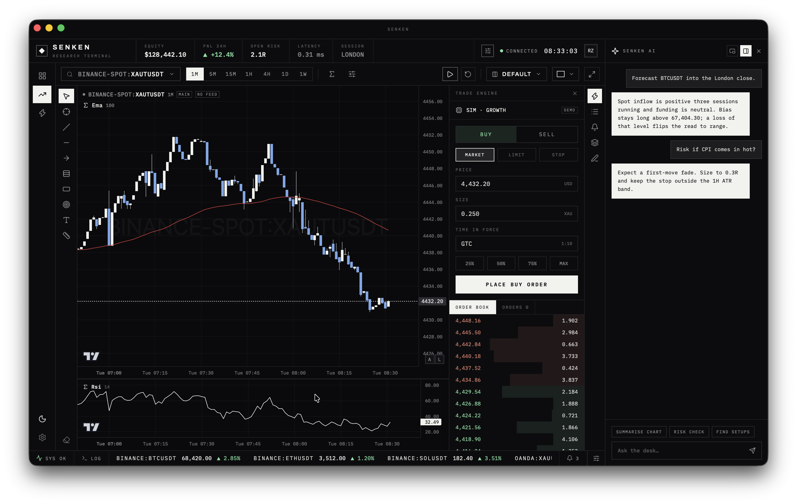

# Senken

> **Fast AF research, zero nonsense.**
> Your ultimate trading research terminal buddy.



A modular market data and trading research platform in Rust.

Senken is a monorepo built around one rule: **every domain crate stands on its
own, and the runtime is what makes them one application.** You can use
`senken-marketdata` as a library in your own project without ever touching
plugins or a runtime; or you can run `senken`, the full application, which wires
every crate and every venue plugin together.

## Zero nonsense, specifically

These are constraints the codebase actually enforces, not aspirations:

- **No `f64` anywhere near money.** Prices, sizes and increments are
  `(scale, size)` integer pairs from end to end. A venue that reports
  `1e-06` or `0.00000100` or `1E-6` lands on the same integer.
- **No invented data.** Where a venue publishes no usable tick size, the adapter
  stores an obvious placeholder and says so — it never fabricates a
  plausible-looking one. See the caveats under [Venues](#venues).
- **No guessed timestamps.** One `UnixNanos` type, UTC, everywhere. Venues that
  report seconds among milliseconds cannot silently slip through, because the
  conversion has to name its unit.
- **No silent collisions.** `(source, symbol)` uniqueness is asserted on write,
  and a series' origin — venue-supplied or locally derived — is part of its
  identity, so the two can never be mixed.
- **No lint suppressions.** `unsafe_code` is forbidden, `clippy::pedantic` is on,
  and there is not one `#[allow]` in the workspace.
- **Fixtures are recorded, never hand-written.** Every venue quirk documented
  below was found because the test data came from a real response.

## Status

Working today: the instrument catalog across 22 venues, cached multi-venue
search, venue-aware rate limiting, the bar and tick domain types with streaming
aggregation, the Parquet store, and the series loader (`crates/loader`). Three
venues — Binance, OKX and Bybit spot — fetch bars too, through the
`BarSource` contract (see [Fetching bars](#fetching-bars)); registering the
other 19 with real bars is unstarted work, not a design gap.

In progress: wiring `senken-runtime` to actually run a `SeriesLoader` against
a registered `BarSource` (today it only wires `MarketDataSource`s), the HTTP
API (`crates/api`), and the web and desktop shell.

Not started: the trade engine.

## Layout

| Path | Crate | Standalone? | Role |
| --- | --- | --- | --- |
| `crates/core` | `senken-core` | yes | `UnixNanos`, scaled integers, path encoding, time ranges — no I/O |
| `crates/storage` | `senken-storage` | yes | Atomic, versioned JSON snapshots in a data directory |
| `crates/marketdata` | `senken-marketdata` | yes | Instruments, ids, the `MarketDataSource` contract, cached multi-venue search |
| `crates/series` | `senken-series` | yes | `Bar`, `BarSpec`, `Origin`, `Trade`, streaming aggregation, `Clock` — pure computation |
| `crates/store` | `senken-store` | yes | Parquet-backed series storage; coverage derived from filenames |
| `crates/venue` | `senken-venue` | yes | Shared venue plumbing: HTTP, retry, rate limiting, decode helpers |
| `crates/plugin` | `senken-plugin` | with runtime | The plugin contract: manifest, activation context, lifecycle, the `MarketDataSource`/`BarSource`/`TradeAdapter` registration surface |
| `crates/loader` | `senken-loader` | yes | Resolution, caching and the job model behind chart and backtest loads |
| `crates/subscription` | `senken-subscription` | yes | The live-data subscription pool: reference-counted, `Drop`-guarded leases on `(source, symbol)`, sharded across a venue's stream cap |
| `crates/trade` | `senken-trade` | yes | The trade engine: the `TradeAdapter` contract, the order/position/balance vocabulary, adapter capabilities, dynamic settings schemas, and the attached-account store |
| `crates/api` | `senken-api` | no | HTTP surface over the runtime |
| `crates/runtime` | `senken-runtime` | no | Assembles storage, domain services and plugins into a running Senken |
| `plugins/*` | `senken-plugin-*` | source: yes | One crate per venue (see below), plus `simulator`, the built-in paper broker |
| `apps/cli` | `senken-cli` | — | Command line front end |

Dependencies only point downward: a plugin depends on a domain crate, never the
reverse; the runtime depends on everything and nothing depends on it.

Arrow and Parquet appear in `senken-store` **and nowhere else**, behind a
feature — so a consumer who wants bar types and aggregation, or who only wants
to inspect what data exists, never compiles a columnar dependency.

## Venues

`senken-marketdata` knows only that *something* registers instruments. How many
sources a venue is split into, and whether those are spot, perpetual, dated or
option markets, is entirely the plugin's decision — one plugin registers as many
sources as its venue has markets.

**22 plugins, 50 sources, 42,763 instruments** at last measurement.

| Plugin | Sources | Markets |
| --- | --- | --- |
| `binance` | 3 | spot, USDⓈ-M futures, COIN-M futures |
| `bingx` | 3 | spot, linear perpetual, inverse perpetual |
| `bitfinex` | 2 | spot, perpetual — see the caveat below |
| `bitget` | 4 | spot, USDT / USDC / COIN futures |
| `bitmart` | 2 | spot, futures (linear and inverse) |
| `bitmex` | 1 | perpetual (linear, inverse, quanto), dated futures |
| `bitstamp` | 1 | spot, perpetual |
| `bybit` | 3 | spot, linear, inverse |
| `coinbase` | 2 | Exchange spot, International perpetual |
| `cryptocom` | 1 | spot, perpetual, dated futures |
| `deribit` | 1 | spot, perpetual, dated futures, options |
| `gate` | 4 | spot, USDT perpetual, BTC perpetual, USDT delivery |
| `gemini` | 1 | spot, perpetual |
| `htx` | 4 | spot, linear, inverse swap, inverse futures |
| `kraken` | 2 | spot, futures |
| `kucoin` | 2 | spot, futures |
| `mexc` | 2 | spot, futures |
| `okx` | 5 | spot, swap, futures, BTC options, ETH options |
| `phemex` | 1 | spot, inverse perpetual, linear perpetual |
| `poloniex` | 2 | spot, perpetual |
| `upbit` | 1 | spot — see the caveat below |
| `whitebit` | 1 | spot, perpetual |

Every venue above was selected on one rule: its API must publish **both** an
instruments list and klines, without an API key.

**Two venues publish no increments.** Bitfinex reports five *significant
figures* for every symbol, and Upbit reports nothing at all — its won prices
move on a banded table that no single per-instrument tick can express. Both
adapters store an obvious placeholder rather than a plausible-looking invention,
and say so in their module docs. Their symbols, legs and market types are real;
their increments are not, and must not be used to round an order.

Every non-crypto provider surveyed (Polygon, Finnhub, Tiingo, EODHD, Alpaca
equities, Twelve Data, Databento) requires a user-supplied API key, and most
forbid redistribution; Finnhub fails the rule outright, since its klines are
paid-only. Crypto is the only asset class coverable with no credentials.

## As a library

```rust,ignore
use std::sync::Arc;
use senken_marketdata::{InstrumentQuery, MarketData};
use senken_storage::Storage;

let storage = Storage::new(".data");
storage.init()?;

let mut marketdata = MarketData::new(Arc::new(storage));
marketdata.register_source(/* any MarketDataSource */)?;

let page = marketdata.instruments(InstrumentQuery::new("btc").with_limit(10)).await;
```

## As the application

```rust,ignore
use senken_runtime::Runtime;
use senken_plugin_binance::BinancePlugin;
use senken_plugin_okx::OkxPlugin;

let senken = Runtime::builder()
    .data_dir(".data")
    .plugin(BinancePlugin)
    .plugin(OkxPlugin)
    .build()?;

let page = senken.marketdata().instruments("xaut").await;
senken.shutdown()?;
```

Or from the shell:

```console
$ cargo run -- sources
$ cargo run -- search xaut
$ cargo run -- search okx:btc --limit 5
$ cargo run -- instrument binance-spot:BTCUSDT
$ cargo run -- refresh okx
```

Add `-v` / `-vv` for diagnostics on stderr, or set `RUST_LOG`.

## Data layout

Everything a source produces lives in one subtree, so a venue's catalog and its
history sit together:

```
.data/sources/{source}/instruments.json
.data/sources/{source}/instruments/{SYMBOL}/bars/{origin}-{spec}/{range}.parquet
.data/sources/{source}/instruments/{SYMBOL}/trades/{range}.parquet
```

The covered range is in the **filename**, so coverage is a directory listing
away — there is no side table that can drift out of agreement with the data.
Files are immutable: extending coverage writes a new file and removes the old,
which is also what makes concurrent readers safe on Windows.

## Writing a venue plugin

1. Declare the venue's JSON in an `api` module, using `senken_venue::Num` for
   any number — venues send the same tick size as a quoted decimal, a bare
   float, or `1e-06`, and `Num` absorbs all three.
2. Write one `fn(&[u8]) -> Result<Vec<Instrument>, SourceError>` per market.
   Honour the fixed-point contract: turn the venue's tick and step into
   `(scale, size)` pairs with `Num::increment` (or `Num::precision` where the
   venue reports decimal places instead). Never go through `f64`.
3. Build a `senken_venue::HttpSource` per market and register each in
   `Plugin::activate`. Take **one limit group per venue** and share its client
   across every source, so a venue's markets draw on one rate budget rather
   than one each:

   ```rust,ignore
   let group = context.limit_group("acme");
   let client = context.venue_client(&group)?;
   context.register_marketdata_source(Arc::new(spot_source(client.clone())));
   context.register_marketdata_source(Arc::new(perp_source(client)));
   ```

4. Record a fixture from a **real** response. Do not hand-write one: every venue
   bug this project has found — a `-1` precision, a missing spot tick size, a
   minimum mistaken for a step, a silently camelCased struct — surfaced only
   because the test data was genuine.

Look at `plugins/gemini` for the smallest complete example, or `plugins/binance`
for a venue split across three markets.

## Fetching bars

A `MarketDataSource` lists what a venue trades; a `BarSource` fetches its OHLCV
history. They are separate contracts (bars need per-call parameters — symbol,
timeframe, range — that an instrument listing's fixed URL cannot express) and
separate registration calls, but **must share one `LimitGroup`**: a venue's
bar traffic and instrument traffic spend the same real quota.

```rust,ignore
let group = context.limit_group("acme");
let client = context.venue_client(&group)?;
context.register_marketdata_source(Arc::new(spot_source(client.clone())));
context.register_bar_source(Arc::new(bar_source(client)));
```

Only Binance, OKX and Bybit spot fetch real bars today
(`plugins/binance/src/bars.rs`, `plugins/okx/src/bars.rs`,
`plugins/bybit/src/bars.rs`) — every other venue would need its kline
endpoint captured live before a `BarSource` for it could be written (never
from documentation alone; see the fixture rule above). Each existing
implementation documents, in its own module docs, that venue's answers to
five recurring traps: which direction it sorts in, whether timestamps are
strings or numbers, how a still-forming candle is detected and dropped, the
*tested* row cap (not the documented one — Binance and Bybit both silently
truncate a request past 1000 rows to HTTP 200, not an error), and which way
its pagination cursor actually moves.

`senken-loader`'s `SeriesLoader` predates the `BarSource` contract and was
built against its own smaller internal port; `senken_loader::PluginBarSource`
is the one adapter that lets a real `BarSource` satisfy it, so the two never
need to be reconciled by hand at every call site.

## Development

```console
$ cargo test --workspace
$ cargo clippy --workspace --all-targets --all-features
$ cargo bench -p senken-marketdata
```

Lints are configured once in the workspace `Cargo.toml` (`clippy::pedantic`,
`missing_docs`, `unsafe_code = "forbid"`) and inherited by every crate.

The MSRV policy is *latest stable*: `rust-version` in the workspace
`Cargo.toml` tracks the newest stable Rust and may rise in any release.

## License

LGPL-3.0-only. See [LICENSE](LICENSE) and [COPYING](COPYING).
